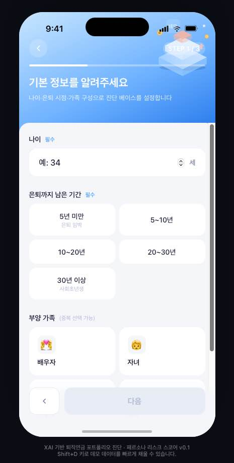
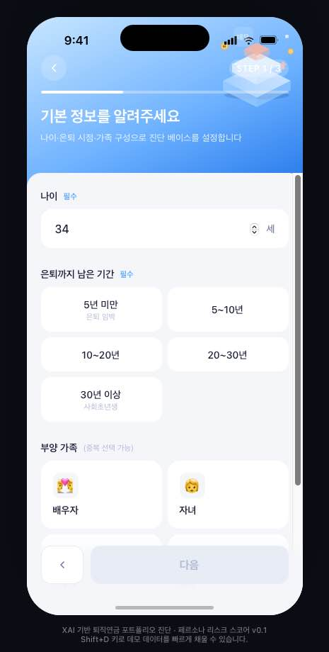
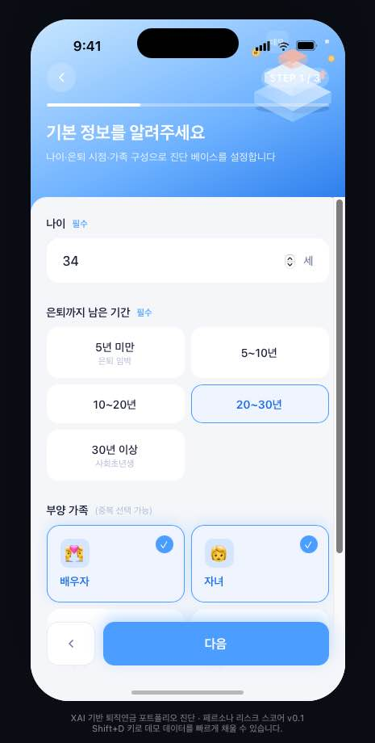
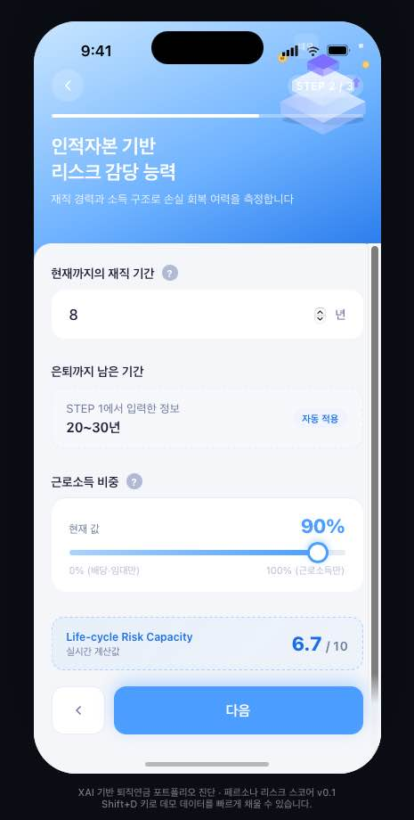

# 퇴직연금 포트폴리오 추천 서비스

> 사용자의 재무 정보와 라이프스타일 텍스트를 결합해 개인 맞춤형 퇴직연금 포트폴리오를 추천하는 모바일 웹 서비스입니다.

---

## 주요 화면

| 온보딩 | 설문 (STEP 1–3) | 추천 결과 |
|:---:|:---:|:---:|
|  |  |  |

---

## 서비스 개요

사용자가 4단계 설문을 완료하면 두 가지 모델(정형 변수 + 라이프스타일 텍스트)이 위험 성향을 분석하고, 최적화된 퇴직연금 포트폴리오(ETF 슬롯 구성)와 XAI 기반 편입 근거를 제공합니다. 결과 화면에서는 AI 챗봇과 대화하며 포트폴리오에 대한 궁금증을 해소할 수 있습니다.

### 설문 흐름

```
홈(Welcome) → STEP 1 기본 정보 → STEP 2 재무 정보 → STEP 3 라이프스타일 → 분석 중... → 추천 결과
```

---

## 기술 스택

### 프론트엔드
- React (CDN, 번들러 없이 JSX 직접 사용) + Babel Standalone
- 모바일 퍼스트 iOS 스타일 UI (`ios-frame.jsx`, `styles.css`)
- Vanilla CSS 애니메이션 (슬라이드 전환, 로딩 효과)

### 백엔드
| 항목 | 내용 |
|------|------|
| 웹 프레임워크 | FastAPI + Uvicorn |
| 챗봇 | OpenAI GPT (스트리밍) |
| 추론 워커 | `persona_infer.py`, `struct_infer.py` (subprocess 파이프 통신) |
| 배포 | Railway (`Procfile`) |

### ML 모델
| 모델 | 역할 |
|------|------|
| `ridge_model.pkl` + `lgbm_model.pkl` | 라이프스타일 텍스트 → 위험 성향 점수 (NLP 앙상블) |
| `struct_model.pkl` | 정형 변수(나이·소득·가입기간 등) → 위험 성향 점수 |
| `ko-sroberta-multitask` | 한국어 문장 임베딩 (SentenceTransformer) |
| PCA (`pca.pkl`) | 앙상블 예측값 → 단일 스코어 축소 |

---

## 프로젝트 구조

```
.
├── Procfile                        # Railway 배포 설정
├── runtime.txt                     # Python 버전 명시
├── requirements.txt                # Python 의존성
│
├── backend/                        # 서버 & ML
│   ├── api_server.py               # FastAPI 서버 (챗봇·추론·CVaR 엔드포인트)
│   ├── persona_infer.py            # 텍스트 추론 워커 (서브프로세스)
│   ├── struct_infer.py             # 정형 변수 추론 워커 (서브프로세스)
│   ├── train_struct_model.py       # 정형 모델 학습 스크립트
│   ├── cvar_returns.json           # 사전 계산된 CVaR 수익률 데이터
│   └── models/                     # 학습된 모델 파일
│       ├── ridge_model.pkl
│       ├── lgbm_model.pkl
│       ├── struct_model.pkl
│       ├── pca.pkl
│       ├── keyword_scaler.pkl
│       ├── score_scaler.pkl
│       └── keyword_meta.json
│
├── frontend/                       # 웹 UI (정적 파일)
│   ├── index.html                  # 앱 진입점 (React CDN 로드)
│   ├── app.jsx                     # 메인 앱 (라우팅·상태 관리)
│   ├── screens-flow.jsx            # Welcome + STEP 1/2/3 화면
│   ├── screens-result.jsx          # 추천 결과 화면 (포트폴리오·XAI)
│   ├── chatbot.jsx                 # AI 챗봇 컴포넌트
│   ├── ios-frame.jsx               # iOS 스타일 프레임 컴포넌트
│   ├── widgets.jsx                 # 공통 위젯 (슬라이더, 카드 등)
│   ├── styles.css                  # 전체 스타일
│   ├── manifest.json               # 웹 앱 매니페스트 (PWA)
│   └── portfolio_data.json         # 포트폴리오 최적화 결과 데이터
│
└── screenshots/                    # UI 스크린샷
```

---

## 로컬 실행

### 1. 환경 설정

```bash
# Python 3.12 권장
pip install -r requirements.txt
```

`.env` 파일을 프로젝트 루트에 생성합니다:

```env
OPENAI_API_KEY=sk-...
```

### 2. 서버 실행

```bash
uvicorn backend.api_server:app --reload --port 8000
```

브라우저에서 `http://localhost:8000` 접속

> `index.html`은 서버가 정적 파일로 서빙합니다. CORS 문제 방지를 위해 반드시 서버를 통해 접속하세요.

---

## API 엔드포인트

| Method | Endpoint | 설명 |
|--------|----------|------|
| `POST` | `/api/chat` | AI 챗봇 (스트리밍 응답) |
| `POST` | `/api/analyze_persona` | 라이프스타일 텍스트 → 위험 성향 점수 |
| `POST` | `/api/analyze_struct` | 정형 변수 → 위험 성향 점수 |
| `POST` | `/api/cvar` | 목표 수익률 기반 CVaR 계산 |

---

## 배포 (Railway)

```bash
# Railway CLI로 배포
railway up
```

Railway 환경 변수에 `OPENAI_API_KEY`를 설정하면 바로 동작합니다.  
`cvar_returns.json`이 포함되어 있어 별도 데이터 파일 없이도 CVaR 계산이 가능합니다.

---

## 위험 성향 점수 산출 방식

1. **정형 점수 (`struct_infer.py`)**: 나이, 직업 안정성, 투자 기간, 부양가족, 소득, 재직 기간 등 14개 변수 → Gradient Boosted 모델 → 0~1 점수
2. **텍스트 점수 (`persona_infer.py`)**: 라이프스타일 자유 기술 → `ko-sroberta-multitask` 임베딩 + 키워드 피처 → LightGBM·Ridge 앙상블 → PCA → 시그모이드 → 0~1 점수
3. **최종 점수**: 두 점수를 가중 평균 → 5개 위험 등급(안정형·안정추구형·위험중립형·적극투자형·공격투자형) 분류

---

## 스크린샷

<details>
<summary>전체 화면 흐름 보기</summary>

| 페르소나 01 (안정형) | 페르소나 02 (균형형) | 페르소나 03 (공격형) |
|:---:|:---:|:---:|
|  |  |  |
|  |  |  |

</details>
